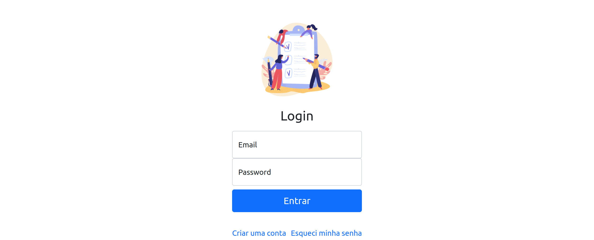
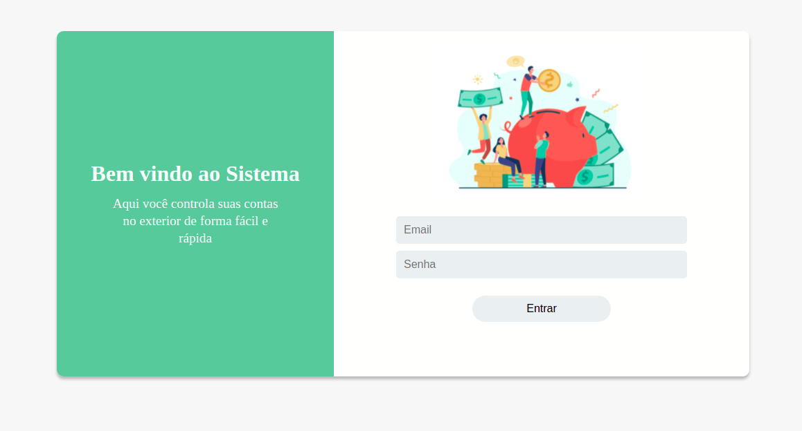
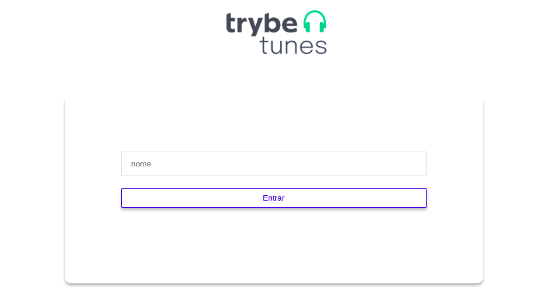
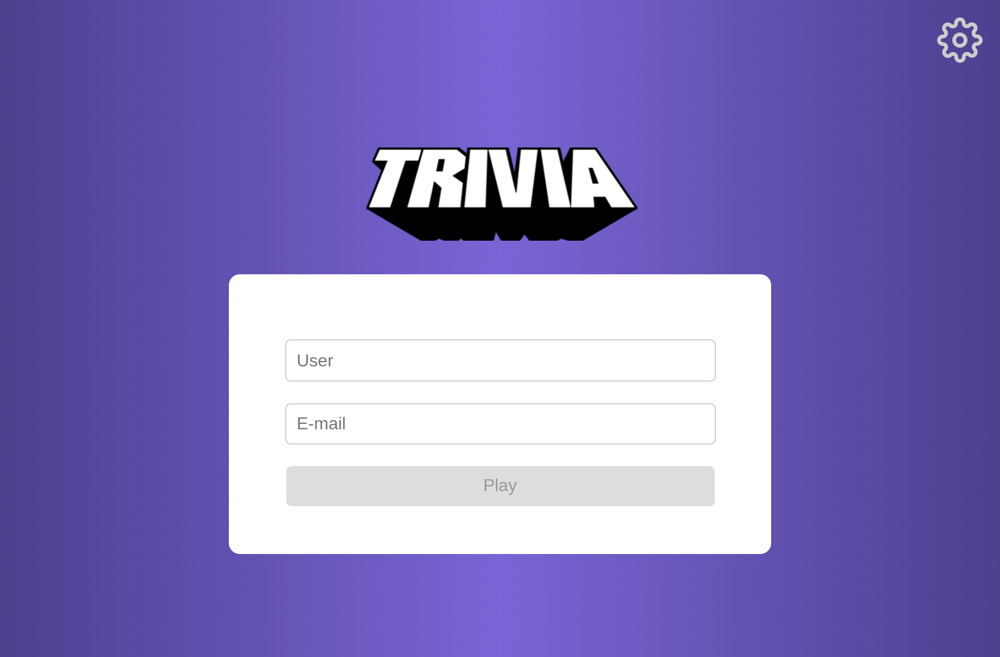
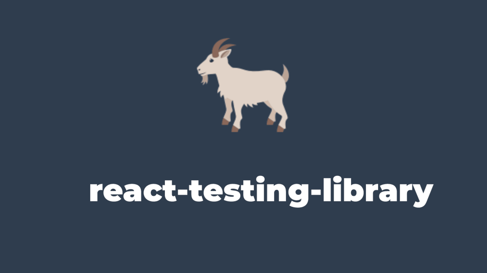
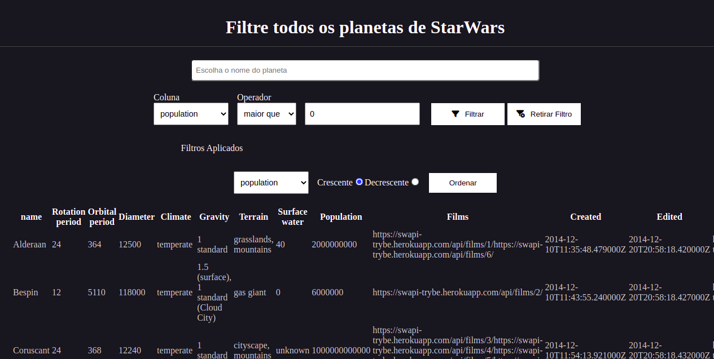
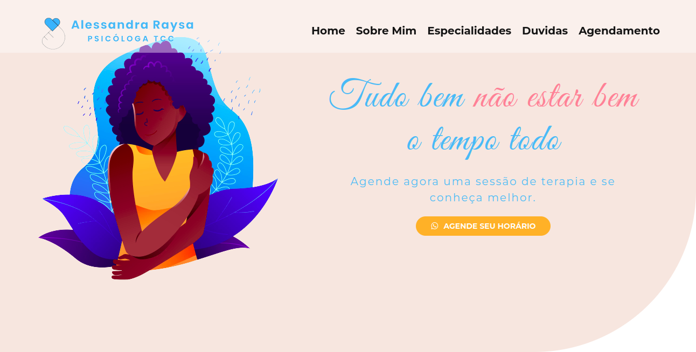

### Olá! Eu me chamo Italo Iveldo 👋

Olá tudo bem ? Me chamo Ítalo, atualmente estudo desenvolvimento web na trybe. Já atuei como estagiário, consultor e gerente de projetos. Em todas as minhas vivências anteriores tive um 'pezinho' na t.i e isso me fez gostar da área e embarcar nessa nova jornada onde busco meu primeiro emprego como desenvolvedor Web.

Já desenvolvi projetos com:
- JavaScript, jest, html e CSS ; 
- React , Redux, hooks RTL e ContextAPI, Firebase
- Trabalho em equipe utilizando versionamento de código no git
- Linux

Here are some ideas to get you started:

- 🌱 Estudando Node ...
- 💬 Contate-me no email: italoiveldoluiz@gmail.com

  <a href="https://github.com/italoO13">
  
  

  
  
 
  <h3 align="left">Languages and Tools:</h3>
  
  
  
  
  
  
  
     

  ##
 

 
  
  
   

<h3 align="left">Selected Projects</h3>
<table>
  
  <tr>
      <td valign="top">
      <h3 align="left">Sistem RH</h3>
      
<a href="https://crud1-4d41d.web.app/">Project preview</a>, <a href="https://github.com/italoO13/System-RH">Repository</a>

      
CSS, HTML and JavaScript

      
    </td>
     <td valign="top">
      <h3 align="left">Suas Despesas</h3>
      
<a href="https://glittering-syrniki-ae0340.netlify.app">Project preview</a>, <a href="https://github.com/italoO13/Suas-Despesas">Repository</a>

       
React, Redux, Jest and RTL

      
    </td>
    <td valign="top">
      <h3 align="left">TrybeTunes</h3>
      
<a href="https://imaginative-frangollo-b70959.netlify.app">Project preview</a>, <a href="https://github.com/italoO13/trybeTunes">Repository</a>

      
React and React Router

      
    </td>
  </tr>
  <tr>
     <td valign="top">
      <h3 align="left">Trivia Quiz</h3>
      
<a href="https://project-trivia-quiz.netlify.app/">Project preview</a>, <a href="https://github.com/italoO13/trivia-quiz">Repository</a>

      
React, Firebase, Sass, Trabalho em Equipe, Redux

      
    </td>    
     <td valign="top">
      <h3 align="left">Pokedex com RTL</h3>
      
Project preview, <a href="https://github.com/italoO13/RLT-com-pokemon">Repository</a>

      
React testing Library

      
    </td>
    <td valign="top">
      <h3 align="left">Filtro Planetas Starwars</h3>
      
<a href="https://startwarsfilterplanets.netlify.app/">Project preview</a>,
      <a href="https://github.com/italoO13/PlanetasStarwars">Repository</a>

      
React, Styled Components

      
    </td>
    
  </tr>

  <tr>
    <td valign="top">
      <h3 align="left">Site Psicologia</h3>
      
<a href="https://reverent-lovelace-b32230.netlify.app/">Project preview</a>, <a href="https://github.com/italoO13/site-psi">Repository</a>

      
CSS, HTML and JavaScript

      
    </td>
  </tr>
  
</table>
