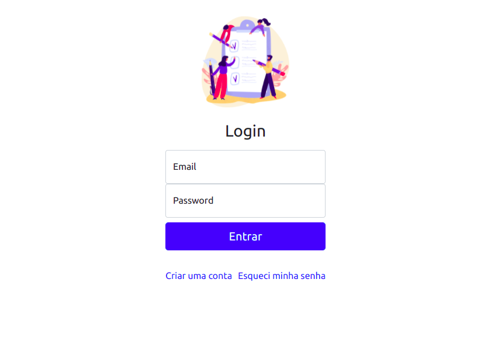
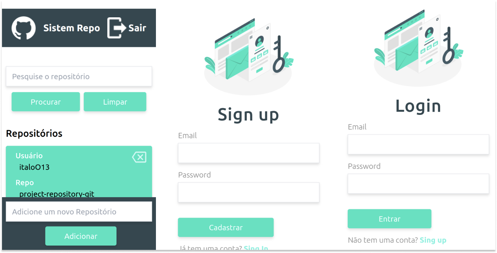
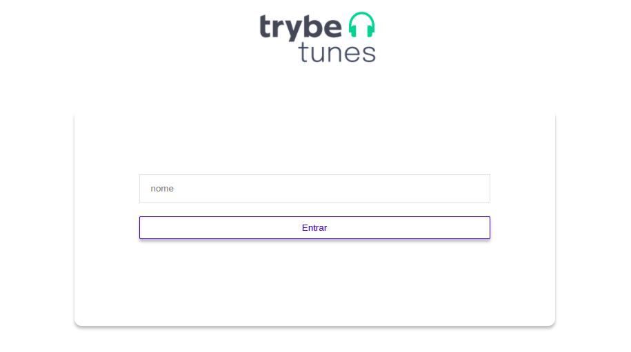
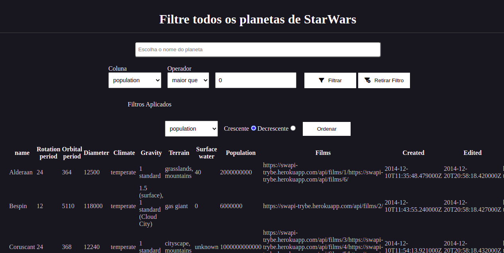

<h1 align="center">Olá, tudo bem ? Me chamo Italo 👋</h1>

###

## 💭 Sobre mim

###

Sou desenvolvedor full stack com forte atuação em back end e foco no desenvolvimento de APIs integrações e sistemas escaláveis.

Atuo profissionalmente com Node.js NestJS e PHP Laravel trabalhando com mensageria cache e processamento assíncrono utilizando SQS SNS e Redis além de testes automatizados e boas práticas de engenharia de software.

Tenho experiência com segurança de aplicações incluindo análise de vulnerabilidades em dependências com Snyk correção de falhas como SQL Injection XSS CSRF e melhorias em autenticação e autorização.

Também atuo com Docker CI/CD e ambientes cloud além de desenvolver interfaces com Vue.js e TypeScript para consumo eficiente de APIs.

Aqui você encontrará projetos pessoais e experimentos técnicos focados em aprendizado contínuo arquitetura de software e qualidade de código.

📨 Contato
Email italoiveldoluiz@gmail.com

LinkedIn https://www.linkedin.com/in/italoiveldo

## 🔧 Linguagens e Ferramentas

###

  
  
  
  
  
  
  
  
  
  
  
  
  
  
  
  
  

###

## 💬 Minhas Redes

###
 

 
  
   

###

## :pushpin: Projetos que mais tenho orgulho

###
 
<table>
  
  <tr>
      <td valign="top">
      <h3 align="left">Sistem RH</h3>
      
<a href="https://crud1-4d41d.web.app/">Project preview</a>, <a href="https://github.com/italoO13/System-RH">Repository</a>

      
React, Firebase, Bootstrap e React Google Charts 

      
    </td>
      <td valign="top">
      <h3 align="left">CRUD de repositórios git</h3>
      
<a href="https://dev-repo-git.netlify.app/">Project preview</a>, <a href="https://github.com/italoO13/project-repository-git">Repository</a>

      
Nodejs, mongoose, react, tailwind, jest, heroku, CI/CD, Figma 

      
    </td>
     <td valign="top">
      <h3 align="left">Suas Despesas</h3>
      
<a href="https://glittering-syrniki-ae0340.netlify.app">Project preview</a>, <a href="https://github.com/italoO13/Suas-Despesas">Repository</a>

       
React, Redux, Jest e RTL

      
    </td>
  </tr>
  <tr>
     <td valign="top">
      <h3 align="left">Trivia Quiz</h3>
      
<a href="https://project-trivia-quiz.netlify.app/">Project preview</a>, <a href="https://github.com/italoO13/trivia-quiz">Repository</a>

      
React, Firebase, Sass, Trabalho em Equipe, Redux

      
    </td>    
    <td valign="top">
      <h3 align="left">TrybeTunes</h3>
      
<a href="https://imaginative-frangollo-b70959.netlify.app">Project preview</a>, <a href="https://github.com/italoO13/trybeTunes">Repository</a>

      
React and React Router

      
    </td>
    <td valign="top">
      <h3 align="left">Filtro Planetas Starwars</h3>
      
<a href="https://startwarsfilterplanets.netlify.app/">Project preview</a>,
      <a href="https://github.com/italoO13/PlanetasStarwars">Repository</a>

      
React, Styled Components

      
    </td>
    
  </tr>
</table>
